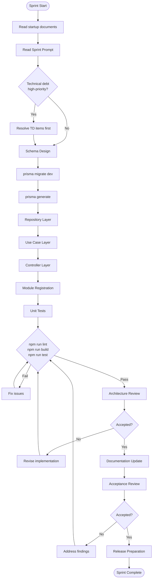
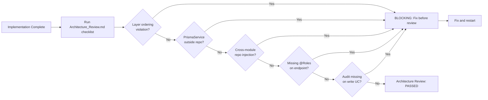
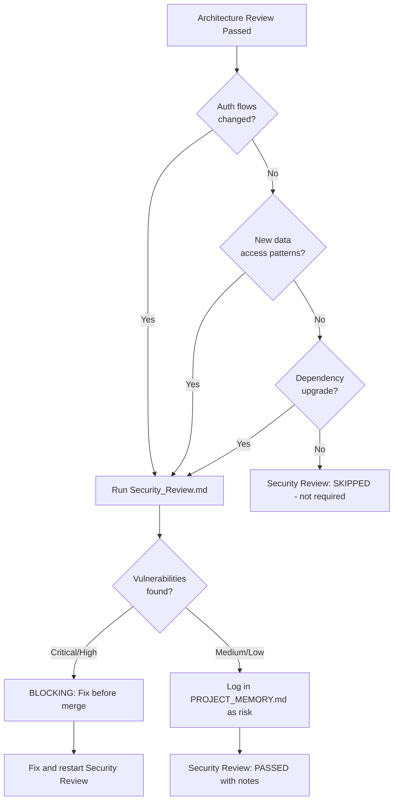
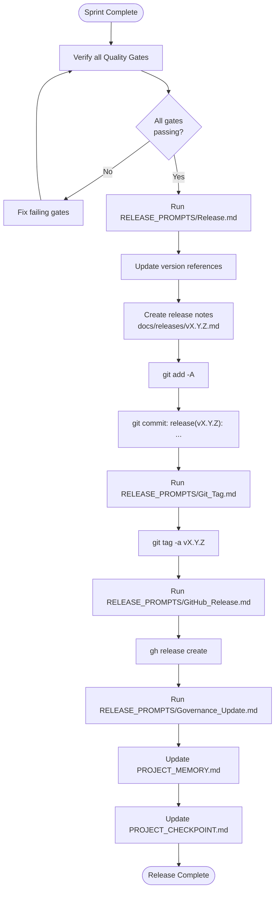
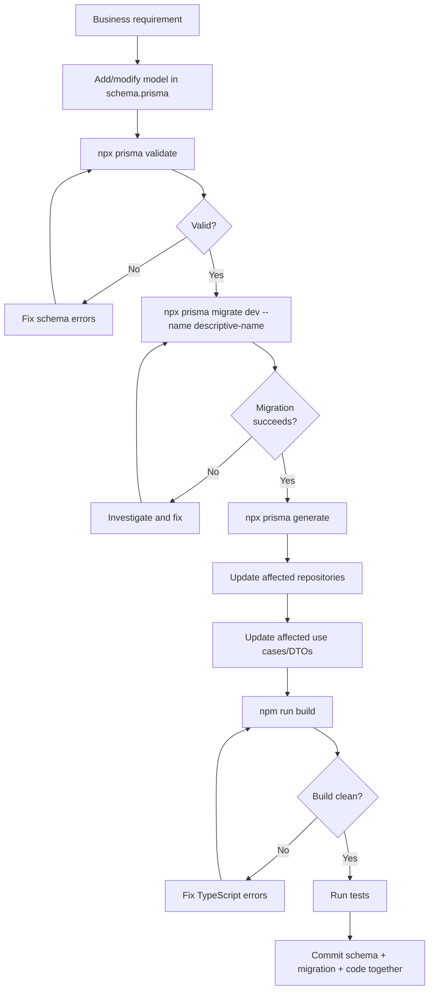
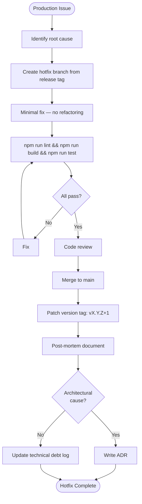

# Engineering Workflow

Complete end-to-end workflow for all FactoryERP development activities.

---

## 1. Feature Implementation Flow



---

## 2. Module Implementation Sequence

Every new domain module follows this strict sequence:

```
Step 1: Schema
  └─ Add models to prisma/schema.prisma (@@schema("factory"))
  └─ npx prisma migrate dev --name {module}-foundation
  └─ npx prisma generate

Step 2: Repository
  └─ src/modules/{domain}/repositories/{domain}.repository.ts
  └─ extends BaseRepository
  └─ implements: create, findById, findAll, update, delete/deactivate

Step 3: DTOs
  └─ src/modules/{domain}/dto/{domain}.dto.ts
  └─ CreateXxxDto, UpdateXxxDto (extends PartialType), ResponseXxxDto

Step 4: Use Cases (one per business operation)
  └─ src/modules/{domain}/use-cases/*.use-case.ts
  └─ src/modules/{domain}/use-cases/*.use-case.spec.ts
  └─ execute() method, audit event, HTTP exceptions

Step 5: Controller
  └─ src/modules/{domain}/controllers/{domain}.controller.ts
  └─ @Controller({ path: '...', version: '1' })
  └─ @Roles(...), @ApiTags, @ApiBearerAuth

Step 6: Module
  └─ src/modules/{domain}/{domain}.module.ts
  └─ Register all providers (use cases, repository, controller)
  └─ Import dependent modules if needed

Step 7: App Registration
  └─ Import module in src/app.module.ts

Step 8: Tests
  └─ npx jest --testPathPattern={domain}
  └─ All use cases tested; happy path + error scenarios

Step 9: Quality Verification
  └─ npm run lint
  └─ npm run build
  └─ npm run test
```

---

## 3. Architecture Review Flow



---

## 4. Security Review Flow



---

## 5. Release Flow



---

## 6. Schema Migration Flow



---

## 7. Hotfix / Emergency Fix Flow

See `PLAYBOOKS/Emergency_Fix_Playbook.md` for the complete procedure.



---

## 8. ADR Creation Flow

```
1. Identify decision
   └─ New technology, pattern, constraint, or trade-off that will affect future code

2. Draft ADR
   └─ Use TEMPLATES/ADR_Template.md
   └─ Status: Proposed
   └─ Fill all sections: Context, Decision, Rationale, Consequences, Alternatives

3. Architecture Review
   └─ Does it contradict any existing Accepted ADR?
   └─ Is the rationale sound?
   └─ Are consequences fully described?

4. Accept
   └─ Change status from Proposed → Accepted
   └─ Assign next sequential number (ADR-NNN)
   └─ Place in docs/architecture/adr/

5. Index
   └─ Add row to docs/architecture/ADR_INDEX.md

6. Commit
   └─ Include ADR commit in the sprint commit
```

---

## 9. Documentation Update Flow

Triggered at sprint completion, release, or any significant architectural change.

| Document | When to Update |
|----------|---------------|
| `docs/PROJECT_MEMORY.md` | Every sprint completion, every release |
| `docs/checkpoints/PROJECT_CHECKPOINT.md` | Every sprint completion |
| `docs/architecture/ADR_INDEX.md` | When new ADRs are created |
| `docs/architecture/ARCHITECTURE_TIMELINE.md` | When a milestone is completed |
| `README_ARCHITECTURE.md` | When phase changes (e.g., entering CMO phase) |
| `docs/releases/vX.Y.Z.md` | At every release |
| `.ai/MASTER_PROMPT.md` | Only with Architecture Board approval + ADR |

---

## 10. Context Recovery Flow

Used when a session has incomplete context or is resuming after a break.

See `AI_SESSION/CONTEXT_RECOVERY.md` for the detailed procedure.

```
1. Read README_ARCHITECTURE.md → understand architecture
2. Read docs/PROJECT_MEMORY.md → understand current phase and status
3. Read docs/checkpoints/PROJECT_CHECKPOINT.md → understand sprint state
4. Read docs/architecture/ADR_INDEX.md → understand active decisions
5. Read .ai/MASTER_PROMPT.md → restore behavior policy
6. Run: npm run lint && npm run build && npm run test → verify health
7. Identify current sprint → read .ai/SPRINT_PROMPTS/Sprint_N_*.md
8. Resume from last documented state
```
